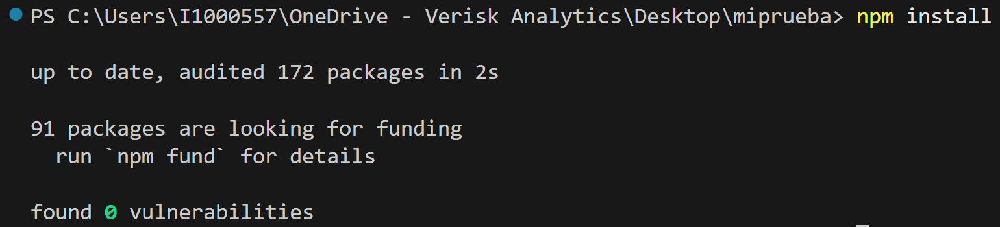
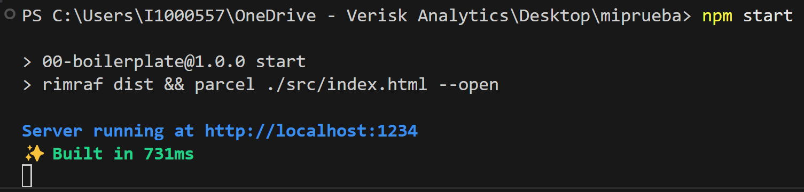
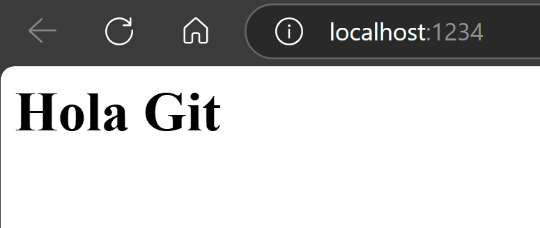
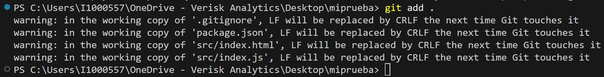
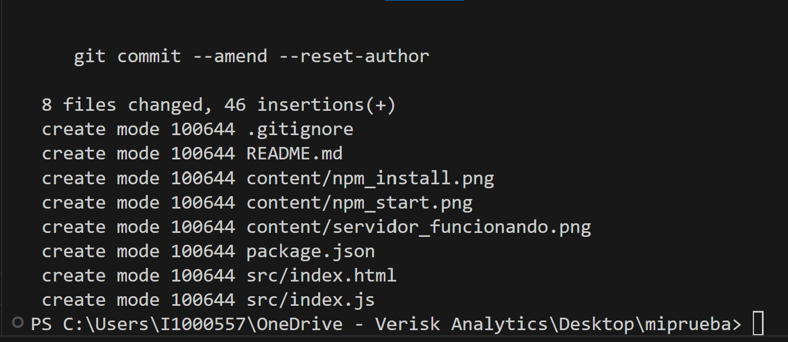
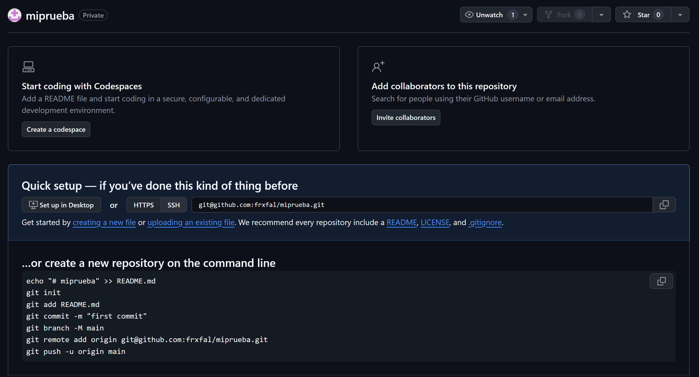
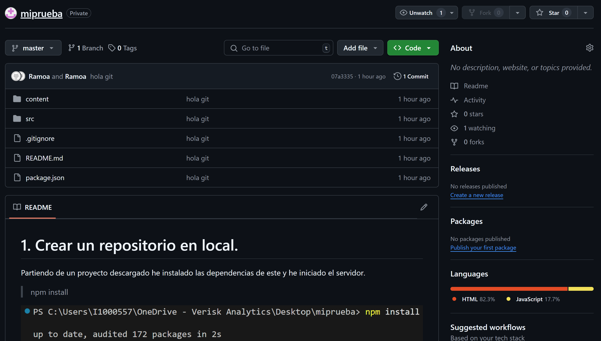
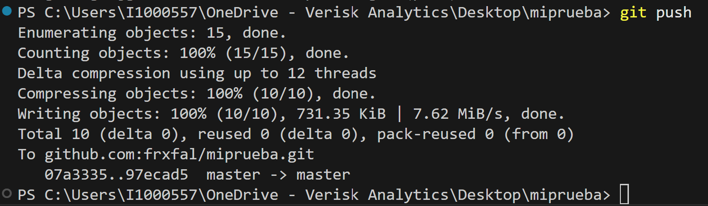
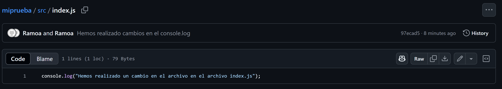

# 1. Crear un repositorio en local.

Partiendo de un proyecto descargado he instalado las dependencias de este y he iniciado el servidor.

> npm install

> npm start

Seguidamente para iniciar el repositorio en local he seguido los siguientes pasos en orden:

> git init

> git add .

> git commit -m "hola git"

# 2. Subir el repositorio a GitHub

Ahora he hecho log in en github y he creado un nuevo repositorio.

Despues de haber creado la clave ssh, he subido el repositorio local al de la nube usando los 2 siguientes comandos:

> git remote add origin git@github.com:frxfal/miprueba.git

> git push -u origin master

Y al actualizar el repositorio en github se ve como se ha actualizado este a los archivos que tenia en el proyecto local:

# 3. Hacer un commit y un push

Para hacer un commit y un push, lo primero es realizar un cambio en el proyecto, yo por ejemplo he cambiado el archivo index.js.

Seguidamente he usado los siguientes comandos:

> git add .

> git commit -m "Hemos realizado cambios en el console.log"

> git push

Y seguidamente al actualizar el repositorio en github vemos como se han realizado dichos cambios.

